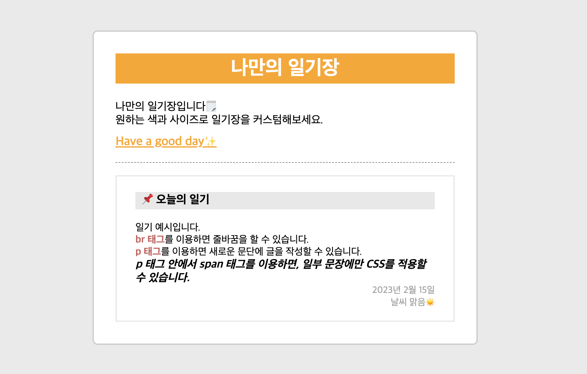

# 나만의 일기장

## 프로젝트 이미지 



<br>

## 트러블 슈팅

### 기본 설정  

기본적으로 부여된 설정을 없애는 작업이 필요하다.  
[box-sizing](https://github.com/ShinjungOh/TIL/blob/main/CSS/box-model.md) 의 기본값 `content-box`를 `border-box`로 수정해준다.

```css
* {
    box-sizing: border-box;
    padding: 0;
    margin: 0;
}
```

### text-align

텍스트를 정렬하고 싶을 때 사용한다.

### block 요소 

`<div>`와 같은 block 요소는 가로값을 주지 않으면 기본적으로 부모 사이즈의 가로 사이즈로 채운다.  
불필요한 코드를 줄여 서버 용량을 줄일 수 있다. 

### dashed

대쉬선을 만들 수 있다. 
```css
.wrapper_head {
    border-bottom: 1px dashed grey;
}
```

### display: block

`<span>` 등의 inline 요소에 margin, padding을 주려면 display: block 설정이 필요하다.

```css
#point {
    display: block;
    margin-top: 10px;
}
```
